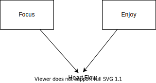

# research
Some explorations about everything related to this project.

## I have words to say
Before we get started, there has a thing that we must understand: "we need a plan to achieve our goals".

It is the same for software development.

We need to splits a big project into multiple small parts.

And then according to the list, we implement them one by one.

## Goal
Try to do a lot of experiments to know what kind of library we needed to build each part of the big project.

Once we know how to implement them, we implement them.

After that, we combine those small pieces into one single software.

## Thinking
### round 1
1. we need a backend service for sure
2. we need a frontend UI to display something to our user for sure

### round 2
1. we need to have a real-time data transfer solution for sure
    - from the basic level, it's TCP/IP.
    - for browser, it is webRTC
    - for apps, it is GRPC
    - it depends on what kind of software we want to build

2. we need a UI framework to build the UI
    - it can be vue3, flutter
    - I'll use flutter for this time to simplify my life with `Row/Column` syntax; and also it's good to use with GRPC; and it checks your code before running

3. I do not consider the deploy problem right now

### round 3
1. server-side
    - experiment 1: can grpc work with rust and flutter (rust is not natively support by google grpc)
        - success, see [this](2022/1.tonic+flutter+grpc)
    - ~~experiment 2: can webRTC work with rust and flutter (this can change the way we transfer data)~~

2. ui-side
    - experiment 1: is it good to just use others [repository](https://github.com/PuzzleLeaf/flutter_clubhouse_ui_clone)?
        - temprarily add a flutter houseclub, see [this](2022/2.houseclub_test)
        - it should work if I simplify the whole stuff until one single page (the chat page)

### round 4
1. ui-side
    - experiment 1: can we makde a simple UI that does record and play for the audio stream?
        - yes, we can!
    - experiment 2: can we use flutter to fetch a user's voice and convert it into bytes and sent it out by GRPC
        - yes, we can! see [this](2022/3.voice_transfering/flutter_client)
1. server-side
    - experiment 1: can we receive voice bytes through GRPC, then forward them to other clients?
        - yes, we can! see [this](2022/3.voice_transfering/rust_service)

### round 5
- experiment 1: can we simplify the other's UI repo into a single page, the chat page?
    - yes, we can! see [this](2022/4.chat_room/flutter_client)
- experiment 2: can we map multiple users' audio streams into the UI in real-time? I mean display who is in speaking.
    - yes, we can! currently, I'm using the uuid to distinguish different users.

### round 6
1. can we seperate rust code into multiple files?
    - yes, we can! you can see this file where I seperated the function. [utils.rs](2022/4.chat_room/rust_service/src/utils.rs)

2. can we use rust to make a minimum jwt auth service?
    - no, I didn't do it with rust, but instead, I did the same thing with python. see [this](2022/5.auth/python_jwt_auth_example)

3. can we make a user system with the help of python?
    - yes, we can! I have made a full-version of user-system with sqlite, you can see it right in [here](2022/5.auth/python_user_system)

4. can we use the `LiveKit` to build a Zoom-like conferencing app in under 100 lines of code?
    - yes, we can! I have made a simple example to demonstrate how we can use their library to make a video chat room. see [this](2022/5.auth/LiveKit/simple_video_chat_room_demo)

### round 7
Find the best practice to design a product.

- how about using `gitbook` to write needs docs?
    - I trust it, it should be fine. (we could save it to github)
- how about we use `draw.io` vscode extension to write the logic graph?
    - 
    - It should work.
- how about using `figma` to design the UX? (I don't need to draw the UI since I'm a programmer. I make it based on my favor. But I indeed need to design the page routes and what kind of widgets shoud be apearing in which page)